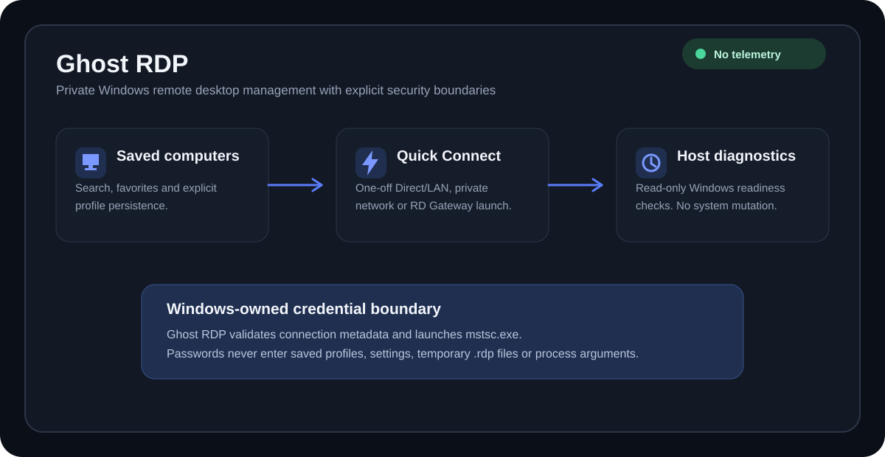

<p align="center">
  
</p>

# Ghost RDP

**Private remote desktop management for computers you control.**

[Windows 10/11](docs/WINDOWS.md) · [.NET 8](docs/BUILD.md) · [CI](https://github.com/bren-wp/Ghost-RDP/actions/workflows/ci.yml) · [Latest production release v0.9.0](https://github.com/bren-wp/Ghost-RDP/releases/tag/v0.9.0) · [Privacy: no telemetry](docs/PRIVACY.md)

Ghost RDP is a Windows-first desktop application for managing Microsoft Remote Desktop connections to computers the user controls. It is built around explicit user actions, Windows security boundaries, local persistence, accessibility, low background activity, and a no-telemetry privacy baseline.

Latest production release: **0.9.0**. Current development version: **0.9.1**.

<p align="center">
  
</p>

## Production features

- Native WPF Windows client with saved computers, Quick Connect, search, favorites, sorting, Settings, and About views.
- Schema-versioned local computer profiles with stable UUIDs and atomic replacement writes.
- Direct/LAN, existing private VPN/overlay, and Microsoft RD Gateway connection routes.
- Safe `mstsc.exe` integration using validated temporary `.rdp` files, strict server authentication, CredSSP, structured process arguments, and no password field.
- Windows-owned credential entry; Ghost RDP does not accept or pass the RDP or RD Gateway password.
- Separate Ghost RDP Host application with read-only Windows readiness diagnostics.
- Windows High Contrast support, visible focus states, access keys, UI Automation names, and production-safe WPF exception handling.
- Self-contained x86, x64, and ARM64 App, Host, Setup, and Portable packages.
- Canonical `setup.exe` and `portable.exe` 32-bit/x86 compatibility downloads plus native x64 and ARM64 builds.
- Per-user Ghost RDP Setup with transactional staging/rollback and Windows Installed Apps registration.
- Windows uninstall through the installed `GhostRDP-Setup.exe --uninstall`; no separate `uninstall.exe` or `unins*.exe` is shipped.
- SHA-256 manifests, PE-architecture validation, runtime self-tests, package validation, and real install/uninstall smoke tests.
- Native ARM64 CI validation on a Windows ARM64 runner.
- Automated GitHub Release publishing only after all architecture jobs pass for the exact release commit.

## UI and UX

The 0.9.1 development line standardizes the App, Host, and Setup visual system around the same dark palette and Windows-native interaction model. Concrete WPF windows receive the intended application background and foreground deterministically, ordinary text has an explicit readable foreground, text fields and dropdowns use matching dark templates, and the sidebar uses lightweight vector navigation icons.

The UI uses vector geometry rather than bitmap-heavy decoration, layout rounding/device-pixel snapping, practical hit targets, visible keyboard focus, and system High Contrast handling. See [UI and UX](docs/UI-UX.md) and [Accessibility](docs/ACCESSIBILITY.md).

## Performance and memory behavior

Ghost RDP does not run telemetry, analytics, advertising, a central relay, background polling loops, or an always-on Windows service. Saved-computer lists use WPF UI virtualization with recycling so off-screen rows do not require a full retained visual tree.

Saved-computer text search uses a short debounce before filtering and sorting, avoiding a full filter/sort/materialization pass for every intermediate keystroke. Sort and favorites changes remain immediate, current selection is restored when the selected profile remains visible, and the favorites total is cached between profile mutations.

Actual working-set memory varies by Windows version, DPI, architecture, .NET runtime state, graphics state, and profile count, so Ghost RDP does not publish an artificial RAM guarantee. The implementation instead avoids unnecessary background activity, keeps the visual tree compact, limits transient allocations, and releases temporary RDP/process resources promptly.

## Runtime dependency policy

Production projects under `src/` intentionally use only the existing .NET 8/WPF/Windows platform stack and Ghost RDP project references. They do not use third-party runtime `PackageReference` dependencies or external file-based assembly references. CI enforces this policy before packaging.

Production releases are self-contained, so end users do not need a separately installed .NET runtime. `mstsc.exe` remains the Windows-owned RDP runtime; Ghost RDP does not bundle another RDP engine. See [Runtime dependencies](docs/DEPENDENCIES.md).

## Security baseline

Passwords are not part of saved computers, Quick Connect persistence, UI settings, generated `.rdp` files, or process command lines. Windows/Microsoft Remote Desktop owns target and RD Gateway credential prompts.

Ghost RDP does not enable Remote Desktop, open firewall ports, configure UPnP or router forwarding, weaken NLA, install a VPN, create a hidden service, or add stealth persistence. Ghost RDP Host is diagnostic-only and does not change Windows RDP/service/firewall/network state. See [Security](docs/SECURITY.md).

## Privacy baseline

There is no telemetry, analytics, advertising, fingerprinting, or central Ghost RDP relay carrying RDP traffic. Saved computers and UI preferences remain under the current Windows user's local application-data directory. Host diagnostics are read locally and are not uploaded. No third-party runtime telemetry/network SDK is included. See [Privacy](docs/PRIVACY.md).

## Downloads

Production releases provide:

- `setup.exe` — x86/32-bit compatibility Setup;
- `portable.exe` — x86/32-bit compatibility Portable client;
- native x64 and ARM64 Setup/Portable executables;
- architecture-specific Portable ZIP packages and Host diagnostics binaries;
- `SHA256SUMS.txt` and `RELEASE-MANIFEST.json`.

The x86 compatibility executables also run on x64 Windows through Windows' x86 compatibility layer. Native x64 and ARM64 builds are provided for architecture-matched execution.

## Build

```powershell
dotnet restore GhostRdp.sln
dotnet format GhostRdp.sln --verify-no-changes --no-restore
dotnet build GhostRdp.sln -c Release --no-restore
dotnet test GhostRdp.sln -c Release --no-build
./scripts/security-regression.ps1
./scripts/build-release-packages.ps1 -Architecture all -OutputDirectory ./artifacts/release
./scripts/validate-release-package.ps1 -ReleaseDirectory ./artifacts/release -Architecture all
```

See [Build](docs/BUILD.md), [Packaging](docs/PACKAGING.md), and [Release validation](docs/RELEASE.md).

## Documentation

- [Documentation index and synchronization policy](docs/README.md)
- [Architecture](docs/ARCHITECTURE.md)
- [Runtime dependencies](docs/DEPENDENCIES.md)
- [UI and UX](docs/UI-UX.md)
- [Security](docs/SECURITY.md)
- [Privacy](docs/PRIVACY.md)
- [Accessibility](docs/ACCESSIBILITY.md)
- [Windows packaging](docs/PACKAGING.md)
- [Release validation](docs/RELEASE.md)
- [Release notes](docs/RELEASE-NOTES.md)
- [Windows behavior](docs/WINDOWS.md)
- [Ghost RDP Host](docs/HOST.md)
- [Remote access model](docs/REMOTE-ACCESS.md)
- [Build](docs/BUILD.md)
- [Roadmap](docs/ROADMAP.md)
- [Changelog](CHANGELOG.md)

## Screenshot policy

Runtime screenshots are accepted only when captured from a real validated Ghost RDP Windows build. Generated mockups are not presented as application screenshots. Until authentic runtime captures are committed, repository-owned branding and technical diagrams are used instead.

## Signing

Current packages are unsigned. Authenticode signing will be added only when an authorized signing certificate or signing service is configured. The project never claims signing that has not been produced and verified.

## License

This repository is licensed under the Mozilla Public License 2.0. See [LICENSE](LICENSE).
